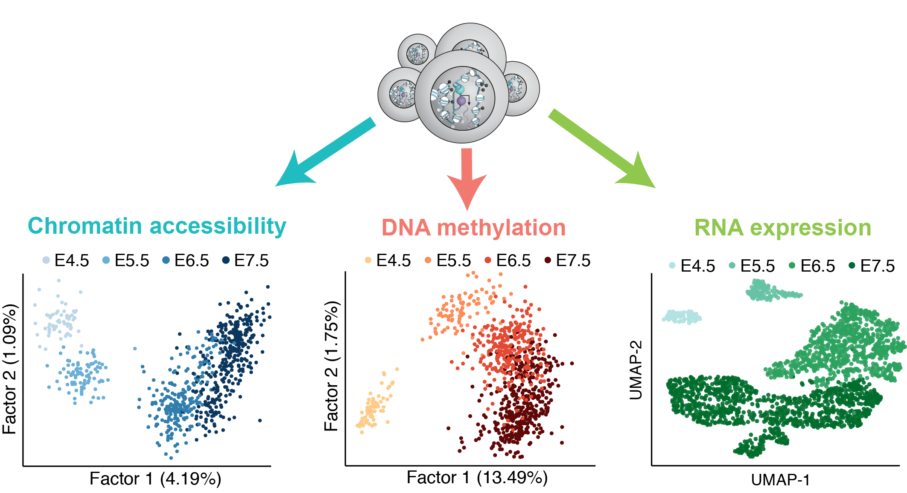

# Single cell multi-omics profiling reveals a hierarchical epigenetic landscape during mammalian germ layer specification

Source code of the manuscript ***Single cell multi-omics profiling reveals a hierarchical epigenetic landscape during mammalian germ layer specification*** ([bioRxiv](https://www.biorxiv.org/content/early/2019/01/13/519207)).

Abstract
--------
Formation of the three primary germ layers during gastrulation is an essential step in the establishment of the vertebrate body plan. Recent studies employing single cell RNA-sequencing have identified major transcriptional changes associated with germ layer specification. Global epigenetic reprogramming accompanies these changes, but the role of the epigenome in regulating early cell fate choice remains unresolved, and the coordination between different epigenetic layers is unclear.  
Here we describe the first single cell triple-omics map of chromatin accessibility, DNA methylation and RNA expression during the exit from pluripotency and the onset of gastrulation in mouse embryos. We find dynamic dependencies between the different molecular layers, with evidence for distinct modes of epigenetic regulation. The initial exit from pluripotency coincides with the establishment of a global repressive epigenetic landscape, followed by the emergence of local lineage-specific epigenetic patterns during gastrulation. Notably, cells committed to mesoderm and endoderm undergo widespread coordinated epigenetic rearrangements, driven by loss of methylation in enhancer marks and a concomitant increase of chromatin accessibility. In striking contrast, the epigenetic landscape of ectodermal cells is already established in the early epiblast. Hence, regulatory elements associated with each germ layer are either epigenetically primed or epigenetically remodelled prior to overt cell fate decisions during gastrulation, providing the molecular logic for a hierarchical emergence of the primary germ layers.  

For more details you can read our preprint: https://www.biorxiv.org/content/early/2019/01/13/519207

 
​

what is scNMT-seq?
--------
scNMT-seq is a sequencing method for simultaneously profiling chromatin accessibility, DNA methylation and the transcriptome at single-cell resolution. 

You can read more about the experimental protocol [here](https://www.nature.com/articles/s41467-018-03149-4)

 
​

Content
-------
* `/met/`: analysis of DNA methylation data
* `/acc/`: analysis of chromatin accessibility data
* `/rna/`: analysis of RNA expression data
* `/metacc/`: simultaneous analysis of DNA methylation and chromatin accessibility data
* `/metrna/`: simultaneous analysis of DNA methylation and RNA expression data
* `/accrna/`: simultaneous analysis of chromatin accessibility and RNA expression data
* `/metaccrna/`: simultaneous analysis of all three omics (MOFA)
* `/H3K27ac/`: analysis of the H3K27ac levels in lineage-defining enhancers
* `/xchr/`: analysis of the  X-chromosome inactivation dynamics
* `/public_datasets/`: re-analysis of publicly available data ([Dai2016](https://www.nature.com/articles/nature20095?proof=true&draft=journal))

Data
-------
The raw data is accessible at GEO ([GSE121708](https://www.ncbi.nlm.nih.gov/geo/query/acc.cgi?acc=GSE121708)). The parsed data can be downloaded here[XXX]

Contact
-------
* Ricard Argelaguet (ricard@ebi.ac.uk)
* Stephen Clark (stephen.clark@babraham.ac.uk)

